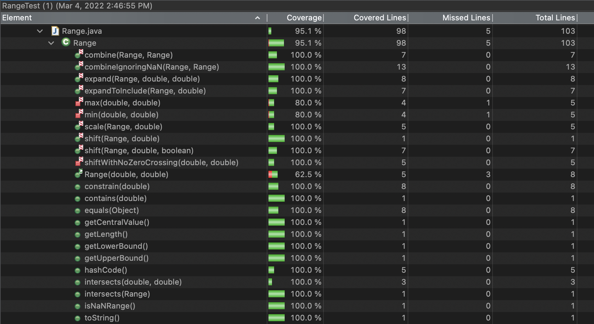
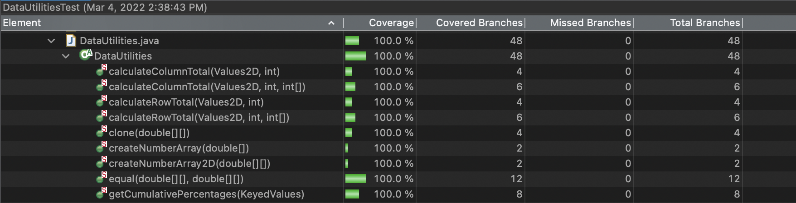
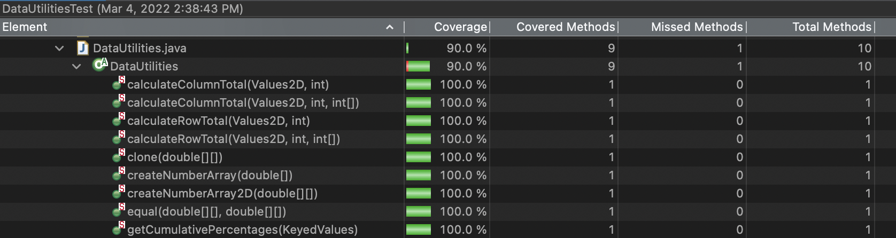

**SENG 438 - Software Testing, Reliability, and Quality**

**Lab. Report #3 – Code Coverage, Adequacy Criteria and Test Case Correlation**

| Group \#:      | 9   |
| -------------- | --- |
| Student Names: |     |
| Weitao Wu      |     |
| Rui Guan       |     |
| Zheng Chen     |     |
| Brian Chen     |     |

(Note that some labs require individual reports while others require one report
for each group. Please see each lab document for details.)

# 1 Introduction

This assignment aims to test our ability to improve our test cases using white box testing techniques. We are required to use the coverage tool to test the coverage of the test cases from last assignment, and use the DFG and DU-pairs to write more test cases in order to increase the line coverage, branch coverage, and method coverage.

# 2 Manual data-flow coverage calculations for X and Y methods

Method: DataUtilities.calculateColumnTotal

the def-use sets per statement:
L125: def={total}
use={}

L126: def={rowCount}
use={}

L127: def={r}
p-use={r} c-use={r}

L128: def={n}
c-use={r,column}

L129: def={}
p-use={n}

L130: def={}
c-use={total, n}

L131: def={}
c-use={total}

list all DU-pairs per variable:
du(1,4,total)={[1,2,3,4]}
du(1,7,total)={[1,2,7]}
du(1,2,rowCount)={[1,2]}
du(2,3,r)={[2,3]}
du(2,7,r)={[2,7]}
du(2,6,r)={[2,3,4,6]}
du(3,4,n)={[3,4]}
du(3,5,n)={[3,5]}

CalculateColumnTotalTest:
testNullValue2DForcalculateColumnTotal(): didn't cover any DU-pairs

testZeroValueForcalculateColumnTotal(): cover all the DU-pairs

testPositiveValueForcalculateColumnTotal(): cover all the DU-pairs except du(3,5,n)

testNegativeValueForcalculateColumnTotal(): du(1,2,rowCount), du(2,3,r)

calculate the DU-Pair coverage:
DU-Pair Coverage=8/8 \* 100% = 100%

Method: Range.constrain

the def-use sets per statement:
L188: def={result}
use={}
L191: def={}
c-use={result}
L194: def={}
c-use={result}
L197: def={}
c-use={result}

list all DU-pairs per variable:
du(1,3,result)={[1,2,3]}
du(1,5,result)={[1,2,4,5]}
du(1,7,result)={[1,7],[1,2,3,7],[1,2,4,5,7],[1,2,4,6,7]}

CalculateColumnTotalTest:

ContainedValue(): du(1,7,result)={[1,7]}

ValueGreaterThanUpper():du(1,3,result)

ValueLessThanLower(): didn't cover any DU-Pairs

ValueLessThanUpperAndGreaterThanLower(): du(1,5,result)

calculate the DU-Pair coverage:
DU-Pair Coverage=3/3 \* 100% = 100%

# 3 A detailed description of the testing strategy for the new unit test

First of all, use the coverage tools to check the coverage of the test cases from last assignment. Line coverage, branch coverage, and method coverage can provide the hints to improve our test cases. Then, check the original code of the classes to see if our test cases check every line of the code. If not, we need to add a new test case to cover it. For example, ParamChecks.nullNotPermitted() is easy to miss in the black box testing. We could write a test case to check this line specifically. Next, draw the DFG and define all the DU-Pairs. Based on the DFG and DU-pairs, we could check through our test cases. If some branches are missing, we need to add more test cases to check them.

# 4 A high level description of five selected test cases you have designed using coverage information, and how they have increased code coverage

DataUtilities.calculateRowTotal((Values2D data, int row):
Before modifying the tests for method DataUtilities.calculateRowTotal((Values2D data, int row), the branch coverage was 75%, and the method coverage and line coverage were 100%. The reason that the branch coverage was not 100% was n=null branch was missing. Therefore, adding one test case which includes a value=null can increase the branch coverage.

DataUtilities.calculateColumnTotalwithArray(Values2D data, int column, int[] validRows):
Before modifying the tests for method calculateColumnTotalwithArray(Values2D data, int column, int[] validRows), the branch coverage was 66.7%, and the method coverage and line coverage were 100%. The reason that the branch coverage was not 100% was n=null branch and row >= rowCount were missing. Therefore, adding test cases which includes a value=null and a out of bound row number can increase the branch coverage.

DataUtilities.getCumulativePercentages(KeyedValues):
Before modifying the test case for method getCumulativePercentages(KeyedValues), the branch coverage was 75%, and the method and line coverage were 100%. The reason why branch coverage was 75% is that the v=null branch was not be covered. Therefore, add one more test case which has one null element (v=null) and the branch coverage becomes 100% now.

DataUtilities.createNumberArray2D(double[][] data):
Before modifying the test case for method createNumberArray2D(double[][] data), the line coverage was 84.6%, and the method and line coverage were 100%. The reason why line coverage was 84.6% is that there should be a object which equals to null and put the object as the parameter of the function instead of just making null as the parameter. Therefore, create an object double[][] inputDoubleArray = null, and call the function as createNumberArray2D(inputDoubleArray), then the line coverage becomes 100% now.

Range.expandToInclude(Range range, double value):
We added test cases of expandToInclude(Range range, double value) in order to increase the Range class coverage (all three metrics). This method contains several if and else branches. Thus, we added test cases that will land in all the branches. The coverage of this method used to be zero but all three metrics coverage reach 100% after the test cases are added.

# 5 A detailed report of the coverage achieved of each class and method (a screen shot from the code cover results in green and red color would suffice)

**Figure 1 - Range Branch Coverage**

**Figure 2 - Range Line Coverage**

**Figure 3 - Range Method Coverage**

**Figure 4 - DataUtilities Branch Coverage**

**Figure 5 - DataUtilities Line Coverage**

**Figure 6 - DataUtilities Method Coverage**

# 6 Pros and Cons of coverage tools used and Metrics you report

We used EclEmma for our coverage tool. EclEmma provides the functionality of Lines Coverage, Branch Coverage, and Method Coverage in this assignment. EclEmma demonstrates the coverage amount and percerntage though column diagram. However, EclEmma does not provide condition coverage that we have to replace it with Method Coverage.

High lines coverage make sure that the all statements were executed. It is easy to achieve but is a weak guarantee of correctness. We reach a high level branch coverage by testing all decisions that traverse the control flow with True and False values. Testing all decisions help to find algorithm problems and catch exceptions. In this lab assignment, a high method coverage can be reached easily since we wrote test cases for all methods. A high method coverage make sure we test the basic functionality of the class/method, but it does not gurantee any condition/path fault discovery.

# 7 A comparison on the advantages and disadvantages of requirements-based test generation and coverage-based test generation.

When we design the test cases of requirements-based generation, we focus on cases to test ducumented functionality and apply boundary testing on the labelled parameters. We may find major program faults. However, it is hard to test all the path and branches in this generation.
For the coverage-based test generation, we focus on the testing all the statements and branches in the coding. It is more likely to find out run time error and catch exceptions. But since we mainly would like to increase the coverage level, we may miss some functionality testing in this generation.

# 8 A discussion on how the team work/effort was divided and managed

At first, everyone need to modify the methods what they did in the assignment 2. This can help us to compare the results we get between two versions. And we made a list of the unmodified methods, and picked anyone by ourselves. If any method was finished, delete it from the list. We covered all the methods in Range.java and DataUtilities.java.

# 9 Any difficulties encountered, challenges overcome, and lessons learned from performing the lab

By comparing lab 2 with lab 3, although black box is one of the common softwafre testing method, it still has some defects. Black box testing tests the software by the requirments of users. Tester can't know the inner logic and structure of the software. It causes that some source codes may not be covered by the test cases, and logic defects also can not be tested by test cases. White box testing can make up for these shortcomings. In white box testing, tester know what's inside the box and how it works. The white box method has a comprehensive understanding of the internal logical structure of the program and tests all logical paths. When using this scheme, the tester can check the internal structure of the program, start with checking the logic of the program, and obtain test data. Both black and white box testing are necessary for the software testing. Tester should use both methods together to test all source code as much as possible.

# 10 Comments/feedback on the lab itself

This assignment gives us a good practise on the white box testing. The technology of using different types of coverage is also practiced. 
